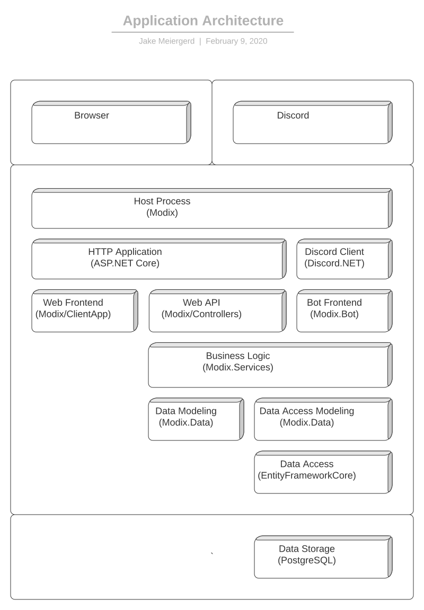

# Application Architecture

## Host Process (Modix)

The MODiX Application is hosted, primarily, within a single process, using the `Microsoft.Extensions.Hosting` platform, and Kestrel. With the exception of third-party services and functionality sensitive to security or reliability (like the REPL), all MODiX functionality is assembled and hosted by this component.

See [Host Process](Host-Process) for more information.

## HTTP Application (ASP.NET Core)

MODiX implements all of its HTTP-based functionality through the ASP.NET Core HTTP Pipeline. See [ASP.NET Core Fundamentals](https://docs.microsoft.com/en-us/aspnet/core/fundamentals/?view=aspnetcore-3.1&tabs=windows) for more information.

The ASP.NET Core Pipeline serves two primary purposes. Firstly, it hosts the static files that make up the Web Frontend (during development, these files are hosted through an instance of node.js, which provides dynamic re-compiling and live-updating services). Secondly, it hosts and provides a framework for the Web API, through which the Web Frontend interacts with the Business Logic layer.

## Discord Client (Discord.NET)

MODiX interacts with Discord and its APIs using [Discord.NET](https://github.com/discord-net/Discord.Net). Primarily, MODiX utilizes the Discord.NET Socket API, meaning it relies upon a connection to the Discord Gateway to maintain a synchronized in-memory model of the "state" of the Discord Guild(s) to which MODiX belongs. It listens for a variety of messages received through the Gateway connection, and forwards them to the Bot Frontend and Business Logic layers for further processing.

See [Discord.NET Documentation](https://github.com/discord-net/Discord.Net) for more information.

## Web Frontend (Modix/ClientApp)

The MODiX Web Frontend is a Browser-hosted application built in TypeScript, with the Vue Application Framework. It provides graphical interfaces that enhance or supplement the command interface provided by the Bot Frontend. Generally, most functionality of MODiX should be accessible through commands, but equivalent interfaces in the Web Frontend should be developed when the commands either require complex user interaction, or seek to display information that is not easily rendered into a Discord embed.

See [Web Frontend](Web-Frontend) for more information.

## Web API (Modix/Controllers)

The MODiX Web API is, really, a sub-component of the Web Frontend. It does not support any clients other than the Web Frontend, and simply allows the Web Frontend to access the Business Logic layer.

See [Web API](Web-API) for more information.

## Bot Frontend (Modix.Bot)

The MODiX Bot Frontend is the primary means by which users interact with MODiX. It consists of three main types of UI elements: commands, logs, and dialogs. Commands are implemented through the Discord.NET Command architecture, and follow a fairly standard pattern of command-line interfacing. Logs are a reactionary function of the Bot Frontend, by which certain actions processed within MODiX, whether initiated by a user on one of the Frontends, or internally, cause the Bot Frontend to render a message and/or embed into a particular, pre-configured "log" channel. Dialogs are used pretty rarely, and are quite similar to log messages, except that the state of the generated message is tracked for some time after the initial message is created. MODiX listens for user interaction with that message (generally in the form of added or removed reactions), in order to allow users to perform business operations.

See [Bot Frontend](Bot-Frontend) for more information.

## Business Logic (Modix.Services)

The Business layer serves as a way to both isolate business logic from user interaction or data storage logic, to support testing, and as a consolidation point, to allow sharing of important functional code with any of the upper layers that might need to use it. Many user-facing "business" operations can be performed through either the Web Frontend or the Bot Frontend, and in such cases, both frontends should ultimately trigger the same "operation" defined within this layer.

Business Logic is defined through two main mechanisms: service actions and notification handlers. Service actions are simply methods upon service classes, that may be called by upper layers, or by other services within this layer. Notification handlers are essentially the same thing, except they are defined to "handle" specific "notifications" that may be published or dispatched by a "messenger", from any layer of the application.

See [Business Logic](Business-Logic) for more information.

## Data Modeling (Modix.Data)

As "feature rich" as MODiX is, it inevitably requires its own system of data storage, separate from Discord. Data Modeling is the process of defining classes in C# code that represent the structure of the data being stored, and of the underlying database that stores it, so that code can be written to interact with that data in a type-safe and testable fashion. It also involves writing (or more usually generating) Migration code to apply structural changes to be applied to the database when necessary, and to allow these changes to be reliably deployed to all instances of MODiX that exist.

See [Data Modeling](Data-Modeling) for more information.

## Data Access Modeling (Modix.Data)

Data Access modeling involves modeling all the various actions that may be performed upon data, or used to retrieve data from the underlying database. This is similar to data modeling, but involves writing code that consists mainly of methods upon classes, rather than properties and fields upon classes. This level of abstraction serves to isolate performance-sensitive code (which almost all Data Access code is) to places where it can be easily understood, tested, and optimized. It also serves to make testing of higher layers easier, by simplifying the complexity of mocking the data access layer.

See [Data Access Modeling](Data-Access-Modeling) for more information.

## Data Access (EntityFrameworkCore)

MODiX utilizes [Microsoft.EntityFrameworkCore](https://docs.microsoft.com/en-us/ef/core/) to perform all data access with the underlying PostgreSQL database. EF Core is what makes the "Data Modeling" and "Data Access Modeling" layers possible, and provides a variety of designer tools to assist developers in writing Data Modeling and Data Access code.
